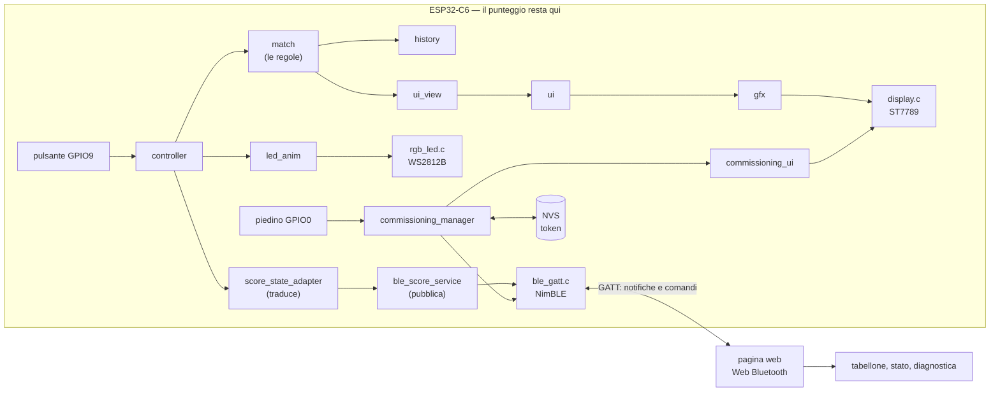
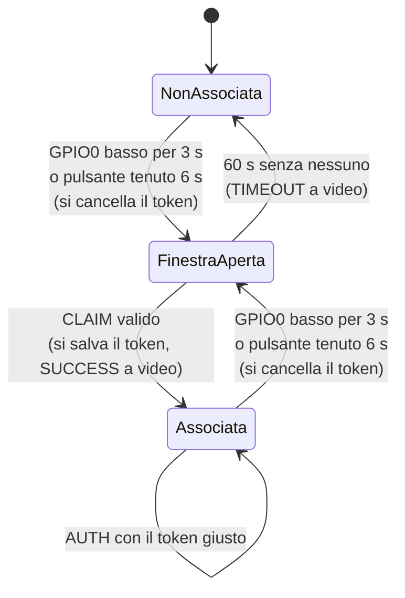

# Bluetooth: come e' fatto e perche'

Questa e' la descrizione del collegamento fra la scheda e una pagina web, dal
punto di vista di chi ci mettera' le mani. Dice dove stanno le cose, com'e'
fatto il protocollo byte per byte, e perche' le scelte non ovvie sono state
fatte cosi'.

L'obiettivo di partenza era uno solo: **la scheda resta la padrona del
punteggio**. La pagina web guarda e, al massimo, chiede di associarsi. Non
calcola, non corregge, non manda punti.

---

## Il quadro d'insieme



Il verso e' uno solo, come nel resto del progetto: il punteggio scende verso la
radio, mai il contrario.

---

## I moduli

Come nel resto del progetto, la divisione importante e' fra i moduli che si
possono provare sul computer e quelli che parlano con l'hardware.

### Pura logica — si provano sul PC, senza scheda

| Modulo | Responsabilita' |
|---|---|
| `ble_protocol` | UUID, opcode, versioni, disposizione dei byte, codifica e decodifica |
| `score_state_adapter` | da `MatchState` al pacchetto: sola lettura, nessun calcolo |
| `commissioning_state` | la macchina a stati dell'associazione: finestra, token, esiti |
| `device_identity` | dall'indirizzo della scheda al nome breve e al nome annunciato |
| `hold_gesture` | riconosce il piedino tenuto basso per tre secondi (una volta sola) |

### Hardware e sistema

| Modulo | Responsabilita' |
|---|---|
| `ble_gatt` | NimBLE: servizio GATT, annuncio, connessioni, notifiche |
| `nvs_store` | l'unica cosa scritta in memoria permanente: il token |
| `commissioning_manager` | la regia: piedino, memoria, stato, radio, schermata |
| `commissioning_ui` | la schermata di commissioning sul display |
| `ble_score_service` | il punto in cui il punteggio incontra la radio |

Fuori da `ble_score_service` non c'e' nessuna chiamata al Bluetooth: e' l'unico
punto di contatto, ed e' voluto. Se un domani si cambia protocollo o trasporto,
si tocca un file solo.

---

## Il servizio GATT

Un servizio, quattro characteristic.

| Characteristic | Proprieta' | Cosa contiene |
|---|---|---|
| `DEVICE_INFO` | READ | chi e' la scheda e in che stato sta |
| `SCORE_STATE` | READ + NOTIFY | lo stato completo della partita |
| `COMMISSIONING_CONTROL` | WRITE | i comandi: `CLAIM` e `AUTH` |
| `COMMISSIONING_STATUS` | READ + NOTIFY | come sta andando l'associazione |

Due regole che valgono la pena di essere scritte:

- **`DEVICE_INFO` e `COMMISSIONING_STATUS` si leggono sempre.** Sono il modo in
  cui la pagina capisce cosa deve fare: senza, non saprebbe nemmeno se deve
  associarsi o riconoscersi.
- **`SCORE_STATE` si legge e si ascolta solo se la connessione si e' fatta
  riconoscere**, quando la scheda e' associata. A una connessione anonima la
  lettura risponde con un rifiuto (`Insufficient Authorization`) e le notifiche
  non partono proprio. La partita non e' un'informazione pubblica.

### Gli UUID

| Nome | Valore |
|---|---|
| Servizio | `6b8d0001-9c4f-4e21-b7a3-0d5e1f2a3b40` |
| `DEVICE_INFO` | `6b8d0002-9c4f-4e21-b7a3-0d5e1f2a3b40` |
| `SCORE_STATE` | `6b8d0003-9c4f-4e21-b7a3-0d5e1f2a3b40` |
| `COMMISSION_CONTROL` | `6b8d0004-9c4f-4e21-b7a3-0d5e1f2a3b40` |
| `COMMISSION_STATUS` | `6b8d0005-9c4f-4e21-b7a3-0d5e1f2a3b40` |

Cambiano solo le ultime quattro cifre del terzo gruppo: si riconosce a colpo
d'occhio che appartengono alla stessa famiglia. Sono scritti in due posti —
`main/ble_protocol.h` e `web/src/ble/protocol.ts` — e non devono cambiare:
il filtro con cui il browser cerca la scheda usa il primo.

---

## I pacchetti, byte per byte

Tutti i numeri piu' lunghi di un byte viaggiano **dal byte meno significativo**
(little-endian), come li scrive l'ESP32 e come li legge
`DataView.getUint16(offset, true)`.

### `SCORE_STATE` — 16 byte

| Byte | Cosa |
|---|---|
| 0 | versione del protocollo (`1`) |
| 1 | tipo di messaggio (`1`) |
| 2 | flag: bit 0 tie-break, bit 1 partita finita, bit 2 serve NOI |
| 3 | vincitore: `0` LORO, `1` NOI, `0xFF` nessuno |
| 4..5 | numero di snapshot |
| 6 | punti LORO |
| 7 | punti NOI |
| 8 | game LORO |
| 9 | game NOI |
| 10 | set LORO |
| 11 | set NOI |
| 12..13 | punti tie-break LORO |
| 14..15 | punti tie-break NOI |

I punti del game sono i valori del motore: `0` = 0, `1` = 15, `2` = 30,
`3` = 40, `4` = vantaggio. **Durante il tie-break restano a zero** e i punti
veri sono quelli contati uno per uno in `tb_points`: chi legge deve guardare il
bit del tie-break e usare l'uno o l'altro campo, come fa la scheda sul display.

Sedici byte e non uno di piu' per una ragione pratica: la notifica BLE piu'
piccola che esista porta venti byte di dati, quindi lo stato arriva anche senza
negoziare la dimensione dei pacchetti — cosa che Web Bluetooth non garantisce.

### `COMMISSIONING_STATUS` — 6 byte

| Byte | Cosa |
|---|---|
| 0 | versione |
| 1 | tipo (`2`) |
| 2 | stato: `0` non associata, `1` finestra aperta, `2` associata |
| 3 | `1` se questa connessione si e' fatta riconoscere |
| 4 | esito dell'ultima operazione (vedi sotto) |
| 5 | secondi che restano alla finestra, `0` se chiusa |

### `DEVICE_INFO` — 8 byte

| Byte | Cosa |
|---|---|
| 0 | versione |
| 1 | tipo (`3`) |
| 2 | stato dell'associazione |
| 3 | `1` se questa connessione e' riconosciuta |
| 4..5 | versione del firmware (byte alto = maggiore) |
| 6..7 | le due cifre del nome breve, come numero |

### `COMMISSIONING_CONTROL` — 17 byte

| Byte | Cosa |
|---|---|
| 0 | opcode |
| 1..16 | token di 16 byte |

Comandi: **`0x01 CLAIM`** crea l'associazione, **`0x02 AUTH`** si fa
riconoscere. Qualsiasi altra cosa viene rifiutata: i comandi hanno una lunghezza
fissa e non esistono versioni future piu' lunghe da accettare.

### Gli esiti

| Valore | Nome | Significato |
|---|---|---|
| 0 | `IDLE` | niente da segnalare |
| 1 | `CLAIM_SUCCESS` | associazione creata |
| 2 | `AUTH_SUCCESS` | token riconosciuto |
| 3 | `AUTH_FAILED` | il token non e' quello salvato |
| 4 | `CLAIM_REJECTED` | `CLAIM` arrivato fuori dalla finestra |
| 5 | `TIMEOUT` | finestra scaduta senza committenti |
| 6 | `PROTOCOL_ERROR` | comando illeggibile |

L'esito e' uno **stato**, non un evento: resta quello che era finche' non
succede qualcosa d'altro. Cosi' la pagina puo' leggerlo in qualsiasi momento e
capire come e' andata anche se ha perso la notifica del momento.

---

## La macchina a stati del commissioning



Le regole, in breve:

- La finestra dura **60 secondi** e si apre in due modi che fanno la stessa cosa:
  il piedino tenuto basso per **3 secondi**, oppure il pulsante di gioco tenuto
  premuto oltre l'azzeramento, fino alla soglia lunga (**6 secondi**).
  Entrambi scattano **una volta sola**: il piedino deve tornare alto, o il
  pulsante dev'essere rilasciato, prima di poterne chiedere un'altra.
- Aprire la finestra **cancella l'associazione precedente** e toglie
  l'autenticazione alla connessione in corso. E' voluto: chi apre la finestra sta
  revocando l'associazione che c'era. Nella memoria della scheda non c'e'
  nient'altro che il token, quindi non si cancella niente d'altro.
- `CLAIM` si accetta **solo a finestra aperta**. `AUTH` si accetta sempre, ma
  riesce solo se il token e' quello salvato.
- L'autenticazione vale **per la connessione**, non per la scheda: se cade il
  collegamento, chi torna deve farsi riconoscere di nuovo.
- L'avviso a video (SUCCESS o TIMEOUT) resta **due secondi**, poi si torna al
  punteggio. Scaduta la finestra la scheda resta non associata, com'era prima.

Le durate si cambiano da `menuconfig` → *Segnapunti padel* → *Bluetooth e
commissioning*, insieme al piedino.

---

## I tre percorsi

### Primo commissioning

1. Si tiene GPIO0 verso massa per tre secondi, oppure si tiene premuto il
   pulsante di gioco fino alla soglia lunga: la scheda cancella quello che
   c'era e apre la finestra. Il display mostra `COMMISSIONING`, il nome, lo
   stato della radio e il conto alla rovescia.
2. Nella pagina si preme **COMMISSIONA SCHEDA**: il browser mostra la sua
   finestra di scelta, si seleziona `PADEL_SCORE_XXXX`.
3. La pagina legge `DEVICE_INFO` e `COMMISSIONING_STATUS`. Se la finestra non
   e' aperta si ferma e lo dice; se e' aperta genera **16 byte casuali** con
   `crypto.getRandomValues()` e li manda con `CLAIM`.
4. La scheda salva il token, chiude la finestra, considera autenticata la
   connessione, mostra `SUCCESS` e conferma.
5. La pagina salva l'associazione (identificativo del browser, nome breve,
   token), si iscrive alle notifiche e legge il punteggio.

### Ritorno a partita in corso

1. La pagina ritrova la scheda: dove il browser permette `getDevices()` lo fa
   da sola all'apertura, altrimenti si usa **RICONNETTI**.
2. Manda `AUTH` col token salvato.
3. Se il token e' buono: si iscrive, legge lo stato e riprende a ricevere. **Lo
   stato si legge subito**, quindi una pagina che arriva a partita iniziata
   vede il punteggio giusto senza aspettare un punto.

### Associazione invalidata

Se qualcuno ha tenuto basso GPIO0, la scheda ha un'altra associazione e il
vecchio token non vale piu'. La pagina riceve `AUTH_FAILED`, cancella
l'associazione locale e mostra *"Associazione non piu' valida"*: si rifa' il
commissioning.

---

## Il numero di sequenza

Ogni pacchetto porta un numero che **avanza di uno a ogni cambiamento di
stato**, e vale sia per le letture sia per le notifiche: due pacchetti con lo
stesso numero descrivono la stessa partita, sempre.

La pagina lo usa per la diagnostica:

| Cosa vede | Cosa significa |
|---|---|
| numeri consecutivi | tutto bene |
| un salto | una notifica non e' arrivata |
| un numero ripetuto | e' arrivato due volte |

Il conto parte da capo **a ogni connessione**: il numero letto all'inizio e'
il punto di partenza, e da li' in avanti i salti sono davvero notifiche perse.
Senza questo azzeramento, i cambiamenti avvenuti mentre la pagina era chiusa
sembrerebbero pacchetti persi, e non lo sono.

---

## Perche' cosi'

**Perche' si manda lo stato intero e non l'evento.** Un pacchetto "punto a NOI"
e' piccolo e veloce da scrivere, ma se se ne perde uno la pagina resta
indietro per sempre. Uno snapshot completo e' vero anche se tutti quelli prima
sono andati persi. Il costo e' sedici byte invece di due.

**Perche' il nome va nella risposta allo scan e non nell'annuncio.** Un
pacchetto di annuncio porta trentuno byte: il nome (diciassette con
l'intestazione) e l'UUID a 128 bit (diciotto) non ci stanno insieme. Nell'annuncio
va l'UUID, perche' e' quello che il browser usa per trovare la scheda; il nome
va nella risposta allo scan, che il browser legge comunque. Se il nome fosse
nell'annuncio, il filtro del browser non troverebbe piu' niente.

**Perche' il token e non una password.** Questo e' un prototipo: l'obiettivo era
avere un'associazione che sopravvive al riavvio e che si possa revocare, non
resistere a un attacco. Sedici byte casuali bastano a distinguere due
installazioni della pagina, e si revocano cancellandoli.

**Perche' niente lavoro pesante nei callback di NimBLE.** Le funzioni di
`ble_gatt` girano dentro il compito dello stack Bluetooth. Un comando ricevuto
viene messo da parte e lavorato nel ciclo principale, insieme al resto: cosi'
una scrittura sulla memoria permanente non ferma la radio, e la radio non ferma
il punteggio.

**Perche' la pagina non calcola il punteggio.** Perche' due programmi che
calcolano la stessa cosa finiscono prima o poi per non essere d'accordo, e a
quel punto non si sa piu' a chi credere. La scheda dice 40; la pagina scrive 40.

---

## La pagina web

```
web/
├── index.html
├── src/
│   ├── main.ts                     il percorso completo e il disegno
│   ├── ble/
│   │   ├── protocol.ts             UUID, opcode, pacchetti (gemello del firmware)
│   │   ├── PadelBleClient.ts       collegamento, comandi, notifiche
│   │   ├── diagnostics.ts          pacchetti, salti, duplicati, ritardi
│   │   └── hex.ts                  il token da byte a testo e ritorno
│   ├── score/ScoreState.ts         il pacchetto diventato tabellone
│   ├── storage/CommissioningStorage.ts   l'associazione nel browser
│   └── ui/                         i tre pannelli
└── test/                           prove dei moduli puri
```

`PadelBleClient` non sa niente di schermate, `ScoreState` non sa niente di
Bluetooth, i pannelli non prendono decisioni. E' la stessa separazione del
firmware, dall'altra parte del filo.

---

## Cosa non c'e' (limiti dichiarati)

- **Una connessione alla volta**: la partita la guarda una persona sola.
- **Nessuna cifratura del collegamento**: l'autenticazione e' applicativa, il
  token viaggia in chiaro su un collegamento BLE non cifrato. Con il Bluetooth
  a basso consumo chi e' nei paraggi puo' ascoltare; non puo' pero' leggere lo
  stato della partita ne' comandare niente senza il token.
- **Il token sta in `localStorage`**: comodo per un prototipo, da rivedere per
  un prodotto.
- **Riconnessione automatica solo dove il browser lo permette**: `getDevices()`
  in Chrome sta dietro un'impostazione sperimentale. Dove non c'e', si passa
  dalla finestra di scelta del browser.
- **Nessun accoppiamento Bluetooth** (`bonding`) e nessun codice PIN: fuori
  dagli obiettivi di questo prototipo.
- La pagina **non scrive** mai il punteggio: puo' solo associarsi e leggere.
